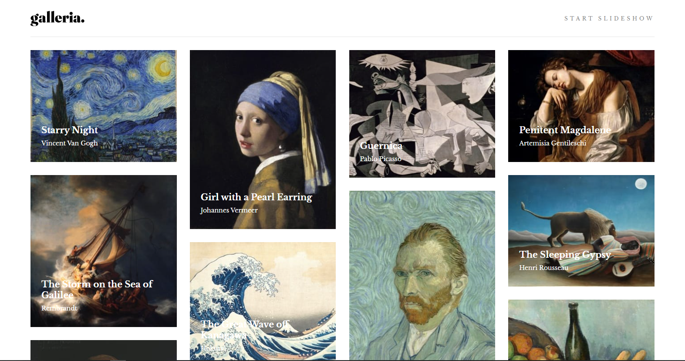

# Frontend Mentor - Galleria slideshow site solution

This is a solution to the [Galleria slideshow site challenge on Frontend Mentor](https://www.frontendmentor.io/challenges/galleria-slideshow-site-tEA4pwsa6). Frontend Mentor challenges help you improve your coding skills by building realistic projects.

## Table of contents

- [Overview](#overview)
  - [The challenge](#the-challenge)
  - [Screenshot](#screenshot)
  - [Links](#links)
- [My process](#my-process)
  - [Built with](#built-with)
- [Author](#author)

## Overview

Galleria! This is a gallery of some of the most iconic paintings that have been made.
This project was done with my first attempt at using typescript

### The challenge

Users should be able to:

- View the optimal layout for the app depending on their device's screen size
- See hover states for all interactive elements on the page
- Navigate the slideshow and view each painting in a lightbox

### Screenshot

-

### Links

- Solution URL: [Orololuwa/galleria](https://www.frontendmentor.io/solutions/galleria-i4rxdnpdQ)
- Live Site URL: [Orololuwa/galleria](https://6142fa958d20290008bfca7c--vibrant-bhabha-af69c2.netlify.app/)

### Built with

- TypeScript
- Semantic HTML5 markup
- CSS custom properties
- Flexbox
- CSS Grid
- [React](https://reactjs.org/) - JS library
- [Styled Components](https://styled-components.com/) - For styles

## Author

- Website - [Emmanuel Orololuwa Awolusi](https://orololuwa.com)
- Frontend Mentor - [@Orololuwa](https://www.frontendmentor.io/profile/Orololuwa)
- Twitter - [@orololuwa](https://www.twitter.com/oroluwa
